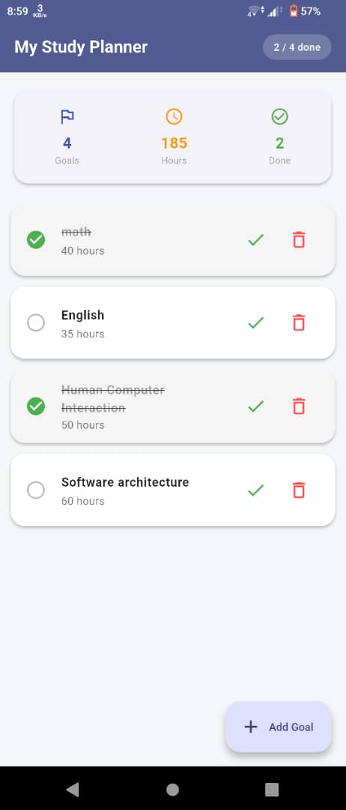
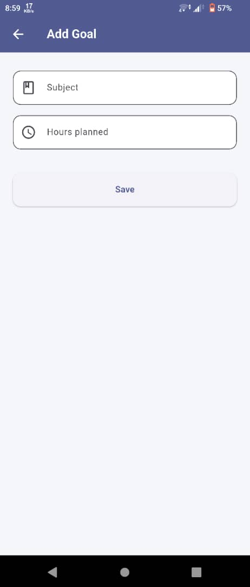

# 📚 My Study Planner

A Flutter mobile application that helps students organize their study goals, track tasks, and manage their academic workload — all backed by local persistent storage.

Built as part of a Mobile Development course assignment at the **University of Lay Adventists of Kigali (ULAK)**.

---

## ✨ Features

- **Goal & Task Management** — Create, edit, and delete study goals and tasks with ease
- **State Management** — Reactive UI updates powered by Flutter's state management
- **Navigation** — Smooth multi-screen navigation flow
- **Reusable Widgets** — Modular, component-based UI architecture
- **Local Persistence** — Data is saved locally using **SQLite** (via the `sqflite` package), so your progress stays available even after closing the app

---

## 🛠️ Tech Stack

| Technology | Purpose |
|---|---|
| [Flutter](https://flutter.dev) | Cross-platform UI framework |
| [Dart](https://dart.dev) | Programming language |
| [sqflite](https://pub.dev/packages/sqflite) | Local SQLite database persistence |

---

## 📱 Screenshots
<p align="center">
  <em>Home Screen </em>

</p>

<p align="center">
  
  &nbsp;&nbsp;
  <p align="center">
  <em>Home Screen </em> 
</p>
&nbsp;&nbsp;
  
</p>


---

## 🚀 Getting Started

### Prerequisites

Make sure you have the following installed:

- [Flutter SDK](https://docs.flutter.dev/get-started/install) (stable channel)
- [Dart SDK](https://dart.dev/get-dart) (comes bundled with Flutter)
- Android Studio or VS Code with the Flutter/Dart plugins
- An Android/iOS emulator or physical device

### Installation

1. **Clone the repository**

   ```bash
   git clone https://github.com/KWIZERA-FRED/Study-Planner-App.git
   cd Study-Planner-App/my_study_planner
   ```

2. **Install dependencies**

   ```bash
   flutter pub get
   ```

3. **Run the app**

   ```bash
   flutter run
   ```

---

## 📂 Project Structure

```
my_study_planner/
├── lib/
│   └── main.dart          # Core application logic: UI, state, navigation, and SQLite integration
├── assets/
│   └── screenshots/       # App screenshots used in this README
├── android/                # Android platform files
├── ios/                     # iOS platform files
├── pubspec.yaml              # Project dependencies and metadata
└── README.md
```

---

## 🧠 How It Works

- The app maintains goal/task state in memory using Flutter's built-in state management (`setState`/`StatefulWidget`).
- Each entry is persisted to a local **SQLite database** through the `sqflite` package, ensuring data survives app restarts.
- Navigation between screens (e.g., home ↔ add goal) is handled using Flutter's `Navigator`.
- The UI is composed of reusable custom widgets to keep the codebase clean and maintainable.

---

## 🗺️ Roadmap

- [ ] Add due-date reminders and notifications
- [ ] Add categories/tags for goals (e.g., by course)
- [ ] Add a calendar view
- [ ] Add cloud sync/backup

---

## 🤝 Contributing

This project was built for academic purposes, but suggestions and improvements are welcome.

1. Fork the repository
2. Create a feature branch (`git checkout -b feature/your-feature`)
3. Commit your changes (`git commit -m "Add your feature"`)
4. Push to the branch (`git push origin feature/your-feature`)
5. Open a Pull Request

---

## 📄 License

This project is open source and available for educational use.

---

## 👤 Author

**Fred Kwizera**
University of Lay Adventists of Kigali (ULAK)
[GitHub](https://github.com/KWIZERA-FRED)
